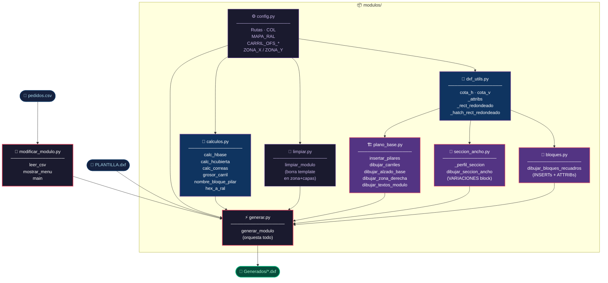

# Arquitectura — modificar_modulo

---

## Orden de ejecución dentro de `generar_modulo`

```mermaid
flowchart LR
    classDef step fill:#0f3460,stroke:#533483,color:#fff,stroke-width:1.5px
    classDef save fill:#064e3b,stroke:#10b981,color:#a7f3d0,stroke-width:2px

    A("1️⃣ calc_*\ndimensiones"):::step
    B("2️⃣ limpiar_modulo\nborra template"):::step
    C("3️⃣ Marco A3\ncajetín escalado"):::step
    D("4️⃣ Contorno\nCorreas · Carriles"):::step
    E("5️⃣ Cotas\nh · v · tablero"):::step
    F("6️⃣ alzado_base\nrect verde +\nCORREA BASE"):::step
    G("7️⃣ seccion_ancho\nperfiles +\ntablero + correa"):::step
    H("8️⃣ bloques_recuadros\nINSERTs ATTRIBs"):::step
    I("9️⃣ insertar_pilares\n⬆️ draw order TOP"):::step
    J("💾 saveas\n*.dxf"):::save

    A-->B-->C-->D-->E-->F-->G-->H-->I-->J
```

---

## Qué módulo tocar según el síntoma

| Síntoma / cambio | Módulo |
|---|---|
| Cambiar rutas, offsets de carriles, zona de limpieza | `config.py` |
| Cálculo de hbase, correas, pilares, grosor carril | `calculos.py` |
| Cotas mal generadas, attribs de bloque incorrectos | `dxf_utils.py` |
| Quedan restos del template en el DXF generado | `limpiar.py` |
| Pilares, carriles, alzado verde, textos del módulo | `plano_base.py` |
| Sección del lado ancho (tablero, correa, perfiles) | `seccion_ancho.py` |
| Bloques recuadros (pilares, muñones, título, serie…) | `bloques.py` |
| Flujo general, marco A3, cajetín, orden de llamadas | `generar.py` |
| CSV, menú interactivo, arranque del script | `modificar_modulo.py` |
